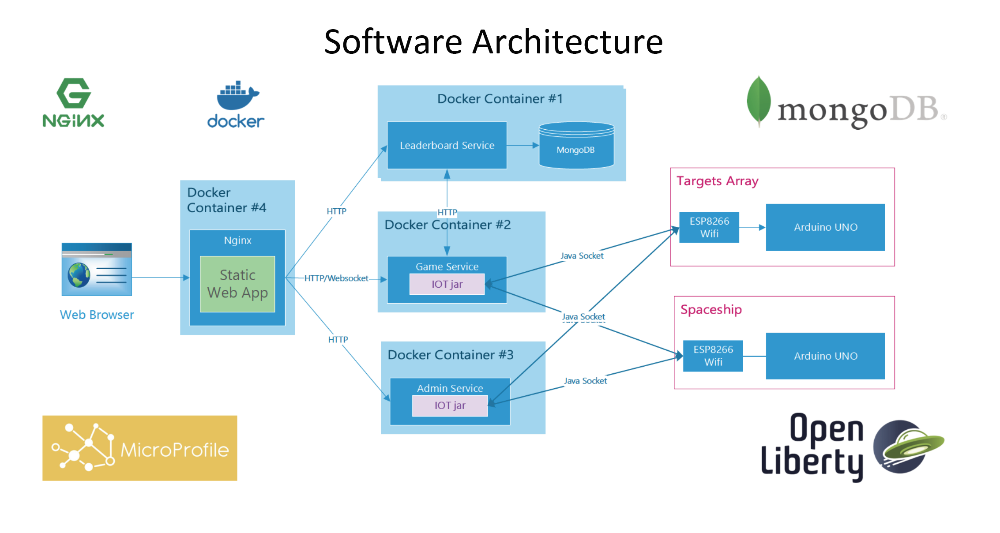
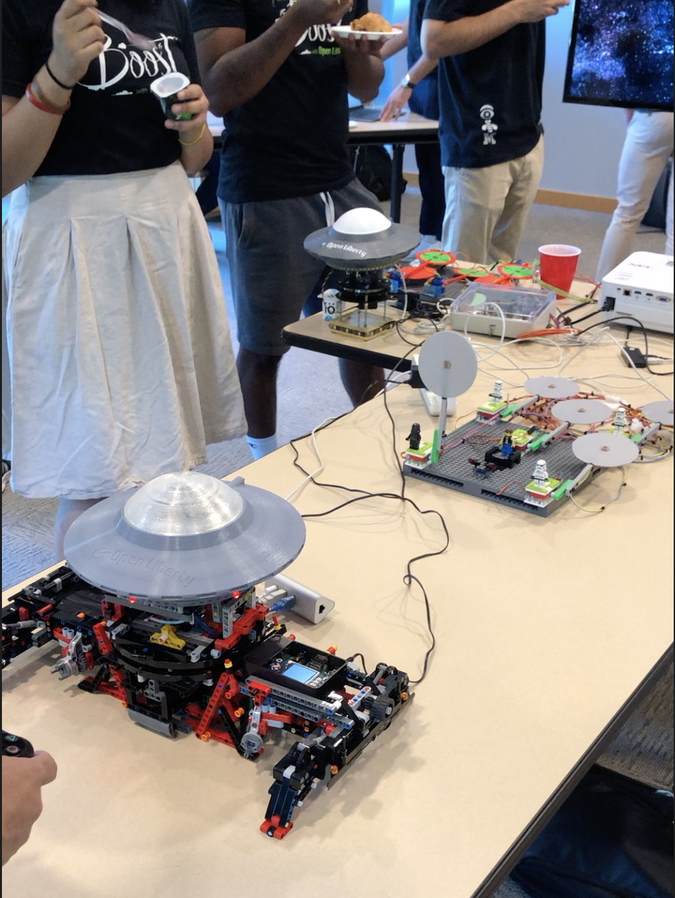
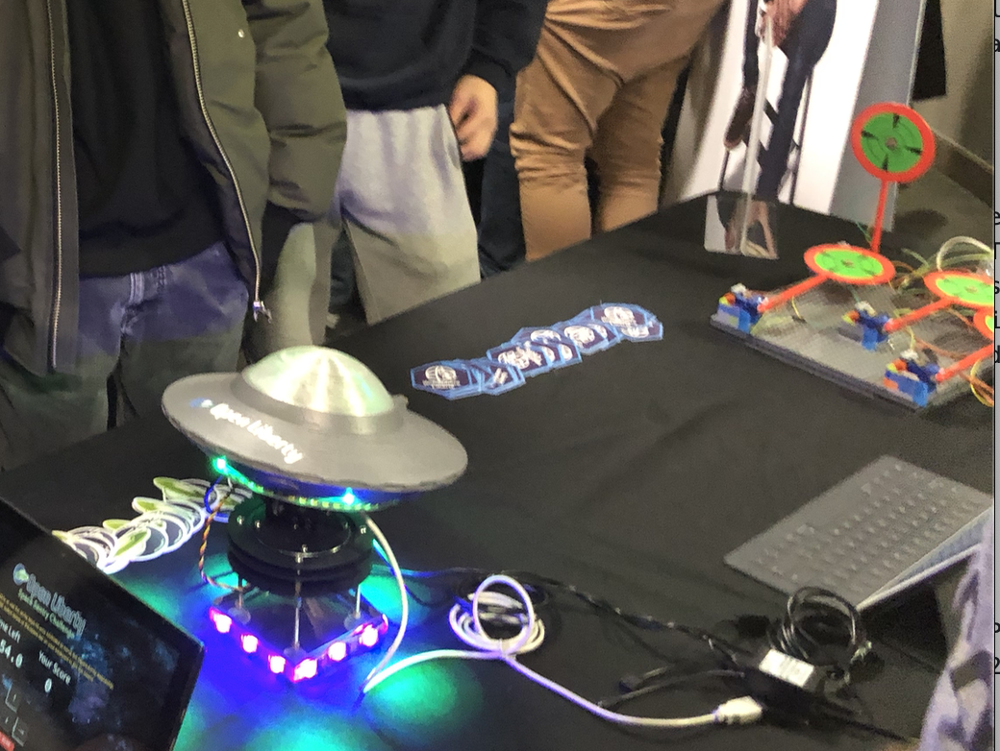

# OpenLiberty Space Sentry Challenge

Open Liberty Space Sentry Challenge is an interactive IoT game designed to showcase Microservices with modern Java technologies in a fun way. The player can take control of a spaceship made of Lego and 3D printed model using a Playstation 4 controller and shoot lasers. The objective is to shoot down as many random popup targets as possible within 1 minute. Since the debut of the game, it has become an instant attraction at various developer conferences and local developer meetups. People loved the mechanics of the game as it's easy to pick up but difficult to master. Moreover, it's the idea behind the game of having different technologies working together with the addition of legos that really helped to reach out to audiences and developer of different technical background. We decided to open source the entire project starting this year, so it can reach out to more people who want to learn Java and microservices using a different approach. We'll be documenting every little bit required to have the project running including Lego assembly instruction, Arduino codes, and most importantly, Java microservice code.

*Space Sentry Challenge V2 Setup*

## Space Sentry Challenge V2

The current version of Space Sentry Challenge is codenamed V2 as it's a total makeover of the original V1 build from both hardware and software perspectives. On the hardware side, we fitted a 100% lego 2-Axis Pan & Tilt system to power the Space ship. The space ship control mechanism is also rewritten to be much more responsive and precise. We also replaced breadboard with custom-designed PCBs to improve the overall reliability of the system. On the software side, we implemented Microprofile Health and Microprofile Metrics for our services. The health and metrics can even be displayed on a small monitor attached to the lego platform. 

*Space Sentry Challenge V2 Setup*

## Space Sentry Challenge V1

The original Space Sentry Challenge is now referred to as V1. It's using a cheap non-Lego 2 Axis Pan & Tilt system. The circuits are also wired on a breadboard instead of custom PCBs. However, we upgraded V1 build with the V2's control firmware, which gives the existing V1 same control responsiveness as the newer V2 build.

*Space Sentry Challenge V1 Setup*

