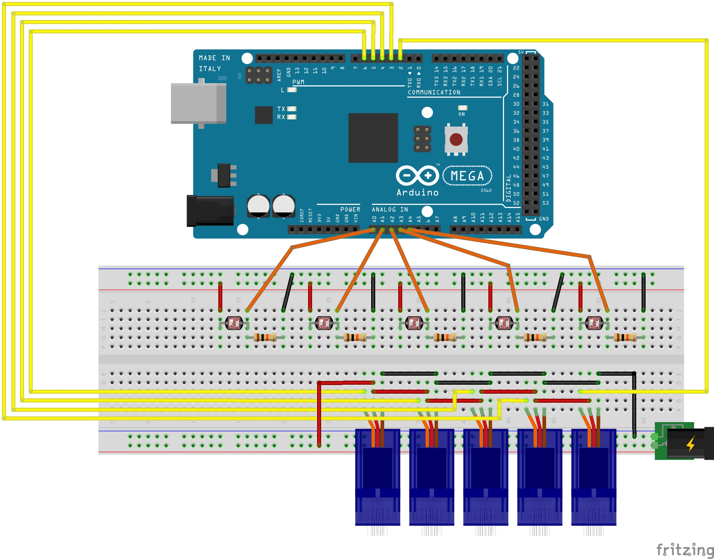
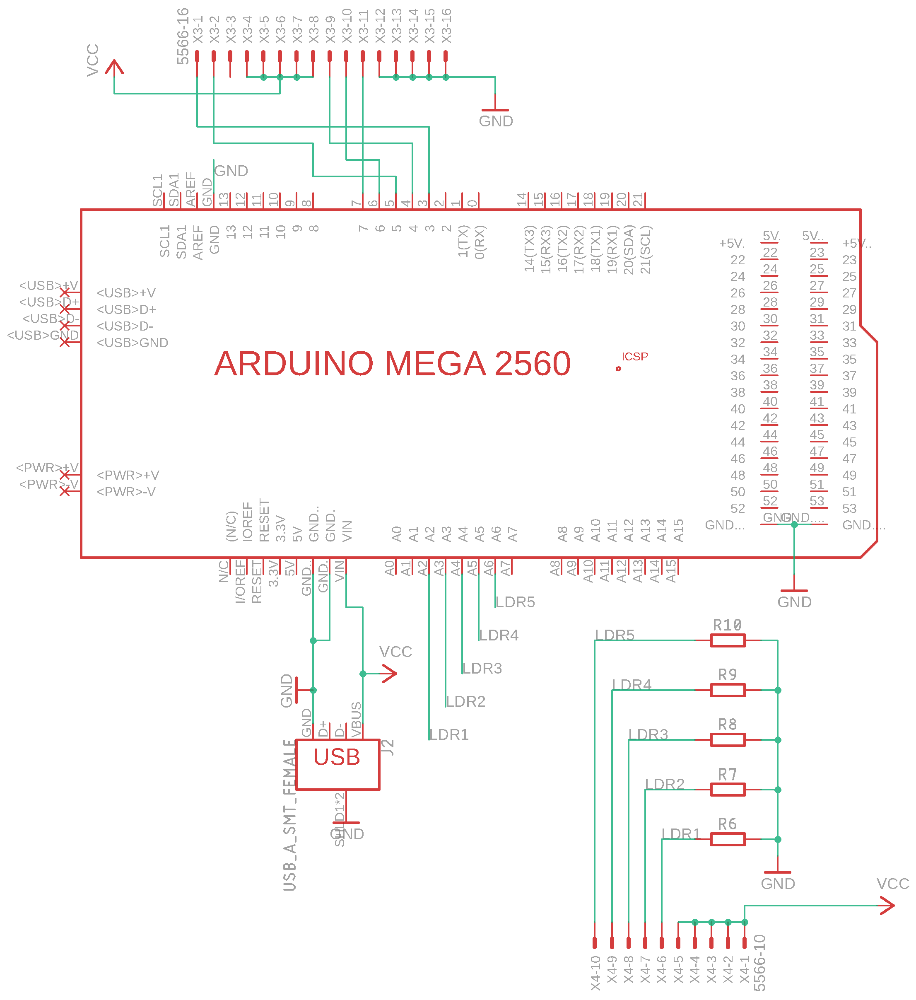
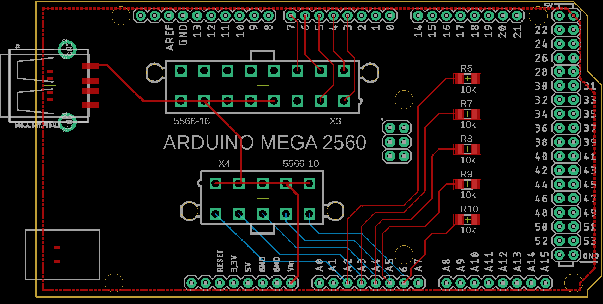

Background
---
Space Sentry V1 used a breadboard to route all external components to the right pins on the Arduino, similar to the schematic shown below: 

While this is the fastest way to build an electronic project, it wasn't robust. The jumper wires connecting parts together were easy to pull apart, and there were many of them. The purpose of the PCB was to provide a better solution to those issues. It reduced the number of pluggables, making the project easier to put together and start up. It also utilizes connectors with tabs, so they cannot be pulled apart accidentally. It completely replaced the breadboard, and reduced the size of the build. The design tool used is Autodesk EAGLE.

Schematic
---
The Arduino shield was built to fit on top of the Arduino MEGA. It needed to have header pins to connect out to the 5 photoresistors, and another to connect to the 5 micro servos. It also has a female USB-A socket to allow for an external power supply which would power the Arduino as well as the servos. The following is the PCB schematic design:

The 5566-16 component is the 16-pin Molex female connector socket which will connect to all of the servos. The 5566-10 is the 10-pin Molex female connector socket which will connect to all of the photoresistors. The 5 resistors labeled R6-R10 are 10kOhm SMD resistors. The following is the PCB Board built from the schematic and fully wired:

The resulting gerber file is given as [pcb-gerber.zip](pcb-gerber.zip). For instructions on how to order the PCBs please refer to the [pcb-ordering.md](pcb-ordering.md) file.
