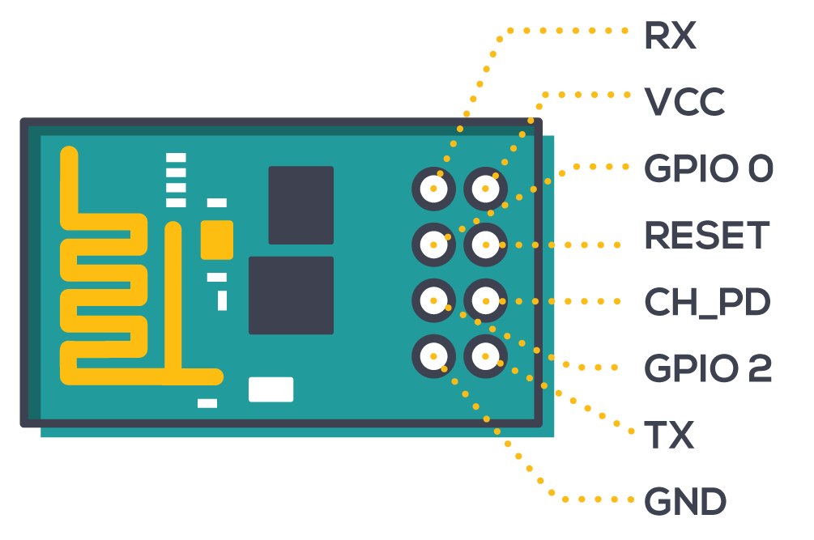

# Soldering the PCB

Ensure you have ordered the necessary PCB, instructions can be found in the [pcb-ordering.md](pcb-ordering.md) file. Ensure you also have all the required components from the parts list found  in the [parts-list.md](parts-list.md) file. Now you can proceed to solder all the components to the PCB.

1. Ensure the PCB came in with no defects, it should look like the photo below
   
   

2. Grab the [5 x 10kOhm 1206 SMD Resistors](parts-list.md), and solder them to the sections labeled R6-R10. For a tutorial on how to properly solder SMD components, refer to this [YouTube video from 7:12-8:06](https://youtu.be/VxMV6wGS3NY?t=432), which explains the method used to solder the resistors onto the board. The resistors are non-polarized, which means that they can be connected in any direction and still function as planned. The first half of the video talks about through-hole soldering which will help with the soldering of the header pins and connectors.

3. Grab the [USB-A Female Surface Mount Socket](parts-list.md), and mount it on the appropriate section.

4. Grab all of the [Break-away 0.1" Male Header Pin Strips](parts-list.md), and break them to fit all the header pin holes on the board. For a video tutorial on how to solder through-hole components, refer to this [YouTube video](https://youtu.be/VxMV6wGS3NY). 
   
5. Note that the dual-sided header pins are to enable the connection of [jumper wires](parts-list.md) which will connect to the [ESP8266 Wifi Module](parts-list.md). The dual sided pins needs to be soldered onto pins 18, 19, the two 5V pins and a single GND pin.
6. The pinout of the Wifi Module is shown in the image below:

7. The pinouts can be connected to the Arduino as shown:

| ESP8266 | Arduino |
| :-: | :-: |
| RX | RX (Pin 19) |
| VCC | 5V |
| GPIO 0 | N/A |
| RESET | N/A |
| CH_PD | 5V |
| GPIO 2 | N/A
| TX | TX (Pin 18) |
| GND | GND |

8. Connect all of the header pins onto the Arduino, and fit the PCB on top to ensure that the header pins will be soldered on straight. Note that the only header pins that needs to be soldered on are the ones with traces that lead to actual components, as well as a single ground pin. However, to ensure board stability, all pins can be soldered on.
   
9. Finally, mount and solder the [Molex Parts #39289168 and #39289108](parts-list.md) onto the board, in section X3 and X4.
   
10. At this point, it is recommended to use the [Multimeter](parts-list.md) to ensure connectivity between two ends of a circuit component, to verify that everything was soldered correctly.

For instructions on creating the wires to connect the servos and photoresistors to the shield, and therefore the Arduino, refer to the [crimping-wires.md](crimping-wires.md) file.