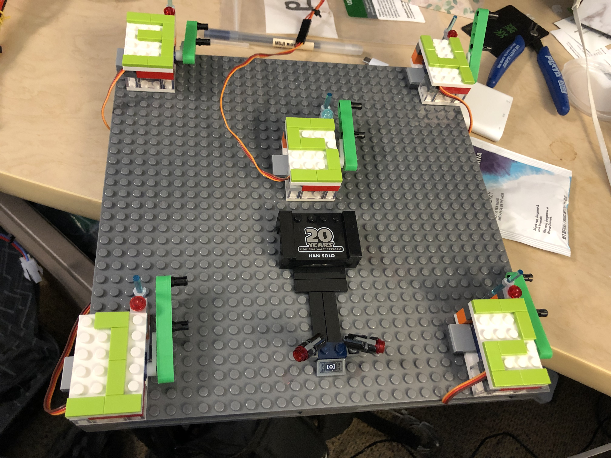
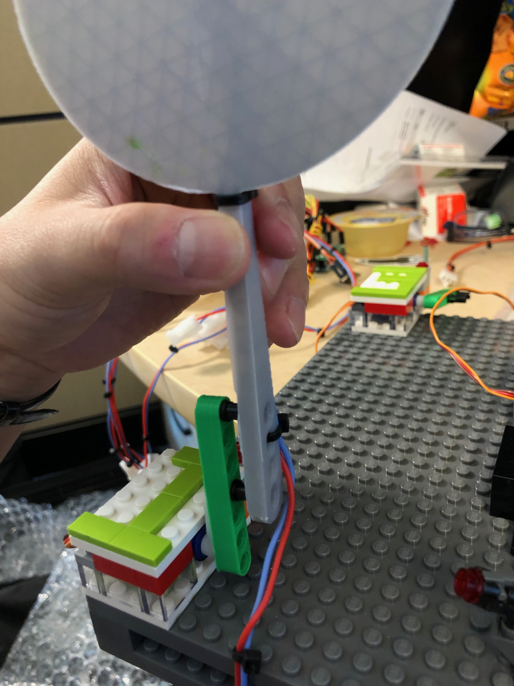
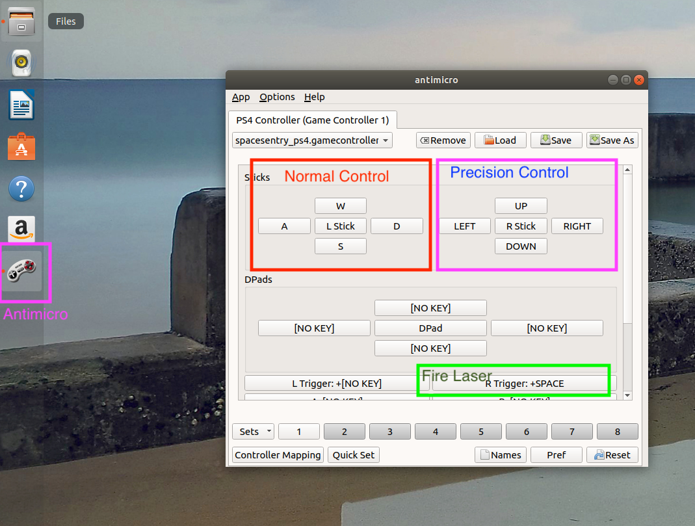
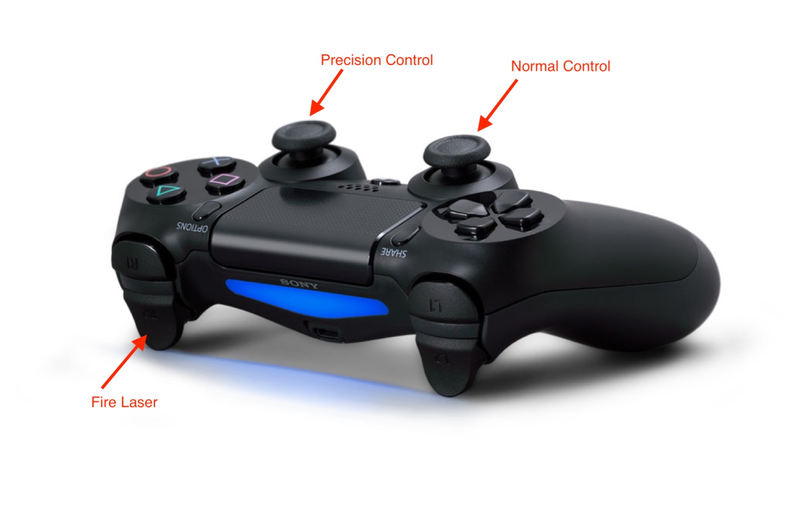

# Space Sentry Challenge Assembly Instruction 

## Unboxing
When you receive the package containing Space Sentry Challenge parcel, make sure all the items required to run the demo are included after unboxing. The complete item list can be found below:

### Targets System
1. Targets base x 5
2. 3D Target with photoresistor x5
3. Arduino mega with custom PCB shield x1
4. Starwars Mini Figure x5
5. USB hub x1

### Spaceship
1. Lego pan & tilt system x1
2. 3D Spaceship with Arduino Mega and NodeMCU x1
3. USB hub x1

## Other
1. Gigabyte Ultracompact mini PC.
2. TPLink Router
3. Raspberry Pi 3B with 1.44HAT monitor attached
4. PS4 controller

### Not included but required to run the demo
1. TV/monitor
2. HDMI cable
3. USB Keyboard & mouse
4. MicroUSB cable for charging PS4 controller
5. Power outlet
6. Power adapters

## Assembly

### Targets Assembly

1. Arrange the servo bases as shown below


2. Attach each target to a target base. 


3. Connect the target servo tri-color wires conectors, make sure the number is a match on both end.
3. Connect the target photo-resistor bi-color connectors, make sure the number is a match on both end.
4. Place the lego mini figures to each of the target (or any where desired)
5. Connect both USB cables to a USB hub. 


### Spaceship Assembly

1. Connect the tri-color servo wires. Make sure the the colors are matched when connecting.

2. Connect both USB cables to a USB hub. 

## Setup

1. Plug TP Link Router to a power source, Internet connection is optional. Place the TP Link Router closer to the two devices.
2. Plug Raspberry Pi to a power source. It should play an Open Liberty animation in loop after a couple of minutes. (Optional)
2. Plug the mini pc to a power source with monitor, keyboard and mouse connected.
3. Connect the USB hub of the targets to a power source. When powered on and connected to the wifi, target #1 should be in standing position while rest of the targets are in resting position.
4. Connect the USB hub of the spaceship to a power source. When powered on and connected to the wifi, blue LEDs to be in the cycle mode.
5. Log in to mini pc, execute the start.sh script on Desktop to start all the services of the space sentry game.
6. Launch antimicro and load *spacesentry* profile with a connected PS4 controller. If the PS4 controller is connected to the mini PC with a USB cable, load *spacesentry-wired* profile.
7. Open Firefox in private mode and visit http://localhost:9084. You should see the home page of Space Sentry Challenge

## Operating Space Sentry Challenge

1. Settings page can show the connection status of target and spaceship hardware and testing capabilities. It's always good to visit this page first to make sure both the targets and the ship are connected with an IP address assigned.
- Test both the devices to ensure all the connections are successfully established.
2. New game is the main game mode of the space sentry challenge. The score of the game session will be stored for leaderboard.
3. Practice game on the othe hand doesn't store the score for leaderboard purpose.
4. The mini display on raspberry pi have three modes: 1. animation, 2. mpHealth, 3. mpMetrics. To switch mode, long press button #2. 
5. In mpMetrics mode, metrics can be switched by long pressing button #1. At the moment, we are only tracking cpu and memory usage provided by Open Liberty mpMetrics.  
## Control Scheme

### PS4 Controller

The PS4 Controller is the default and the recommended way of playing Space Sentry Challenge. It is enabled when a PS4 controller is connected by Bluetooth or by USB with *antimicro* program launched. Make sure to launch *antimicro* before running the game. You should see the following window when antimicro is launched with PS4 controller and control profile detected.



_Figure: Antimicro PS4 controller keymappings_

The ship's movement can be controlled by two thumbsticks of the PS4 controller. The left stick allows the swift and fast movement of the spaceship, or the normal control. The right stick allows the much slower but more precised movement of the spaceship, or the precision control. 

The laser can be fire by pressing the right trigger button. The laser will be ignited for 5 seconds and will need the player to press the trigger button again to turn it on.

The overall control scheme of the PS4 controller is the following:


_Figure: PS4 controller control scheme_

### Keyboard Controller

To play it with keyboard, use *W* *A* *S* *D* keys for normal control of the spaceship. Use arrow keys for precision control of the spaceship. Space bar is for firing the laser turret.

## Troubleshooting

The most common problem we have encountered was that one or more of the hardware is not connected and hence the game cannot be started, or the player lost control of the spaceship. There are a few things that might lead to connectivity problems.

1. Make sure all the docker containers are up and running. There should be 5 docker services running: admin, game, leaderboard, mongo and webapp-nginx.
2. Make sure the ESP wifi modules are connected with the arduino for both targets and the spaceship. You can try pinging the devices to see if there is any response.

ping targets
```
ping 192.168.0.109
```

ping spaceship
```
ping 192.168.0.111
```

3. On rear cases, the socket connections might not be completed closed between game sessions. In that case, we need to **power cycle** both spaceship and the target, and redeploy **admin** and **game** services. 

Redeploy admin service
```
~/space-sentry-challenge/services/undeploy_admin.sh
```
```
~/space-sentry-challenge/services/deploy_admin.sh
```

Redeploy game service
```
~/space-sentry-challenge/services/undeploy_game.sh
```
```
~/space-sentry-challenge/services/deploy_game.sh
```
